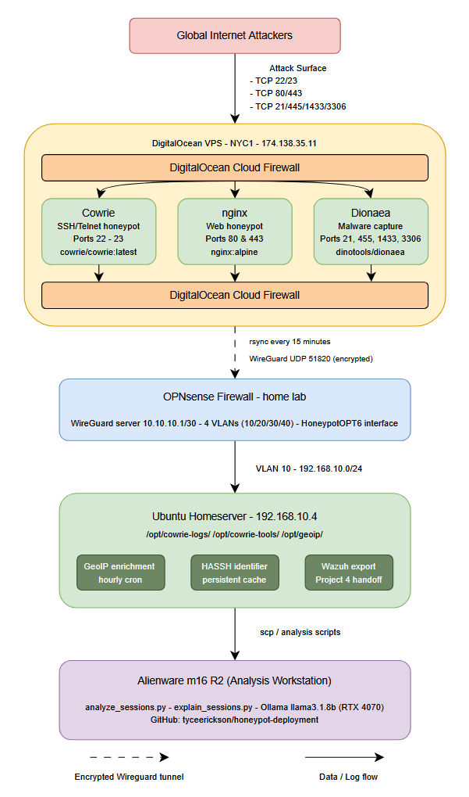

# Honeypot Deployment — Internet-Facing Attack Intelligence Platform

> **Internet-facing SSH/Telnet/HTTP/SMB honeypot capturing real attacker behavior from global threat actors.**
> Deployed on DigitalOcean NYC1. Logs forwarded via encrypted WireGuard tunnel to on-premises Ubuntu Server.
> Part 3 of a 4-project cybersecurity portfolio leading into Carnegie Mellon University's MSISPM program.

---

## Results (6-Day Capture: May 21–28, 2026)

| Description | Total |
|-------------|-------|
| Total events captured | 11,611,908 |
| Unique attacker IPs | 1,321 |
| Countries represented | 105 |
| Credential attempts | 873,373 failed · 5,358 successful |
| Successful fake logins | 5,358 |
| Commands executed in fake shell | 501,689 |
| Malware download attempts | 165,580 |
| Web attack requests (nginx) | 6,225 |
| Unique SSH tool fingerprints | 51 |
| Capture period | May 21 18:14 UTC → May 28 15:28 UTC (6 days, 21 hours) |

> **Final results: 11,611,908 events · 1,321 unique IPs · 105 countries · 6-day capture (6d 21h).** Honeypot live May 21–28, 2026. Includes a ~23-hour data gap from a disk-full incident on May 24–25 (see docs/09-lessons-learned.md).

---

## Architecture



---

## Honeypot Stack

| Service | Container | Ports | Captures |
|---------|-----------|-------|----------|
| Cowrie | `cowrie/cowrie:latest` | 22, 23 | SSH/Telnet credentials, full session transcripts, commands, file transfers |
| nginx | `nginx:alpine` | 80, 443 | Web scanner requests, CVE probes, path traversal, Log4Shell attempts |
| Dionaea | `dinotools/dionaea` | 21, 445, 1433, 3306 | Malware binaries, SMB exploits, FTP uploads, database credential attempts |

---

## Data Pipeline

```
Cowrie/nginx/Dionaea logs
         │
         │ rsync every 15 minutes
         │ via WireGuard tunnel (encrypted)
         ▼
Ubuntu Server /opt/cowrie-logs/
         │
         │ GeoIP enrichment (hourly cron)
         │ MaxMind GeoLite2-City + GeoLite2-ASN
         ▼
cowrie_enriched.json
(src_country, src_city, src_asn, src_org added to every event)
         │
         │ export_to_wazuh.py (Project 4 handoff)
         ▼
Wazuh SIEM ingestion
```

---

## Documentation

| # | Document | Description |
|---|----------|-------------|
| 01 | [Architecture Overview](docs/01-architecture-overview.md) | Full system topology, VPS specs, tunnel design, home lab integration |
| 02 | [Deployment Guide](docs/02-deployment-guide.md) | Step-by-step deployment procedure, all commands, verified outputs |
| 03 | [Firewall & Network Config](docs/03-firewall-and-network-config.md) | All firewall rules with policy rationale, WireGuard config, routing |
| 04 | [Attack Surface Design](docs/04-attack-surface-design.md) | Why each service was exposed, expected attacker behavior, data types |
| 05 | [Data Pipeline](docs/05-data-analysis-pipeline.md) | Log schemas, rsync pipeline, GeoIP enrichment, Wazuh export format |
| 06 | [Analysis Report](docs/06-analysis-report.md) | 6-day intelligence report — credentials, commands, tools, geography |
| 07 | [MITRE ATT&CK Mapping](docs/07-mitre-attack-mapping.md) | Observed techniques mapped to ATT&CK framework with log evidence |
| 08 | [Security Design Philosophy](docs/08-security-design-philosophy.md) | Rationale behind every major architectural and security decision |
| 09 | [Lessons Learned](docs/09-lessons-learned.md) | What went wrong, what surprised us, defensive recommendations |

---

## Analysis Scripts

| Script | Purpose |
|--------|---------|
| `analysis/analyze_sessions.py` | Credential analysis, command frequency, tool fingerprinting, geographic breakdown (reads GeoIP-enriched Cowrie JSON) |
| `analysis/explain_sessions.py` | LLM-powered session transcript explanations via Ollama llama3.1:8b |
| `pipeline/enrich_logs.py` | GeoIP enrichment — adds country/city/ASN to every event |
| `pipeline/export_to_wazuh.py` | Transforms Cowrie JSON to Wazuh-ingestible format for Project 4 |

> Note: the headline dataset (11.6M events) was queried from the OpenSearch/Wazuh index, which held the complete capture; the flat enriched-JSON files synced via rsync were partial due to a log-rotation gap. See docs/09-lessons-learned.md (Lessons 7–8).

---

## Repository Status

| Milestone | Status |
|-----------|--------|
| M0 — Repo scaffold + architecture design | ✅ Complete |
| M1 — VPS deployed, WireGuard tunnel live | ✅ Complete |
| M2 — Full honeypot stack live (Cowrie/nginx/Dionaea) | ✅ Complete |
| M3 — 6-day capture complete, data processed | ✅ Complete — 11,611,908 events captured |
| M4 — Analysis report + MITRE ATT&CK mapping | ✅ Complete — full dataset analyzed |
| M5 — Wazuh export pipeline | ✅ Complete |
| M6 — Final documentation + README polish | ✅ Complete |

---

## Portfolio Context

This is Project 3 of a 4-project cybersecurity portfolio:

| Project | Repository | Status |
|---------|-----------|--------|
| 1 — Home Lab Infrastructure | [home-lab-infrastructure](https://github.com/tyceerickson/home-lab-infrastructure) | ✅ Complete |
| 2 — AI Network Traffic Classifier | [ai-traffic-classifier](https://github.com/tyceerickson/ai-traffic-classifier) | ✅ Complete |
| 3 — Honeypot Deployment & Analysis | **This repository** | ✅ Complete |
| 4 — AI-Powered SOC Pipeline | [ai-soc-pipeline](https://github.com/tyceerickson/ai-soc-pipeline) | ✅ Complete |

The Cowrie session logs, Dionaea malware captures, and nginx web attack logs produced here become the training/test data for the Project 4 Wazuh SIEM and AI-powered SOC dashboard.

---

## Certifications & Background

- **CompTIA Security+**, **Network+**, **ISC2 CC**
- BS in Management Information Systems — Weber State University (3.69 GPA, April 2026)
- Entering **Carnegie Mellon University MSISPM** — Fall 2026
