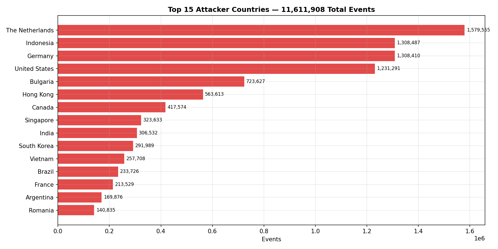
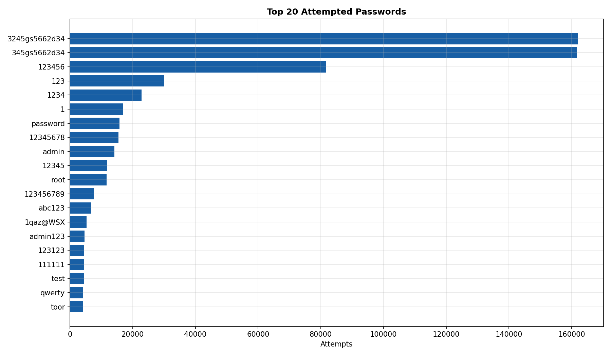
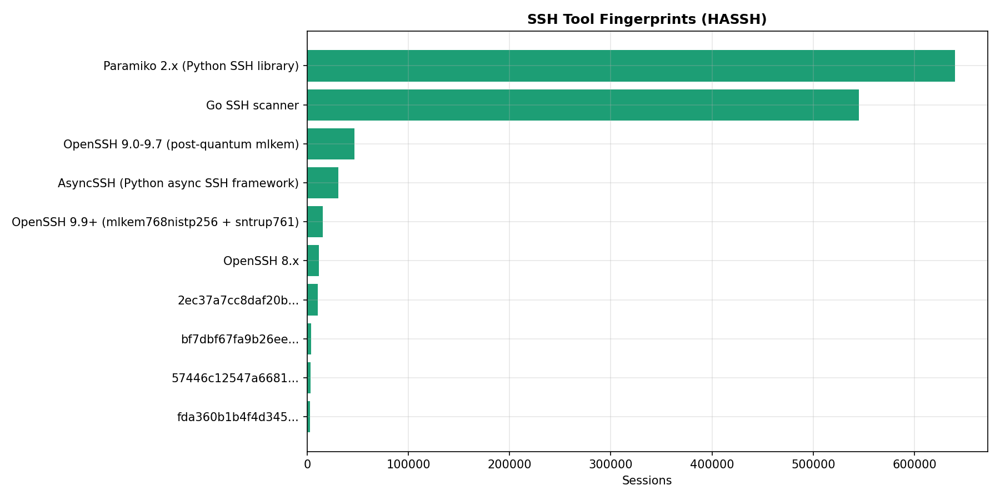
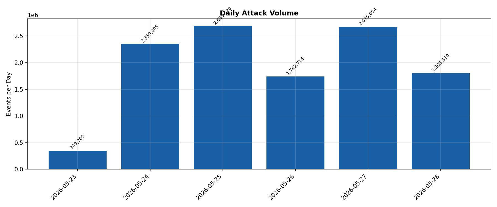

# Attack Analysis Report — Honeypot Deployment

> Generated: 2026-05-28 17:01 UTC  
> Dataset: Full 6-day OpenSearch export — 11,611,908 Wazuh alerts  
> Script: `analysis/analyze_sessions.py`

## Summary

| Metric | Value |
|--------|-------|
| Total events | 11,611,908 |
| Unique source IPs | 1,321 |
| Countries represented | 105 |
| Successful logins | 5,358 |
| Failed login attempts | 873,373 |
| Commands executed | 501,689 |
| File downloads attempted | 165,580 |
| File uploads attempted | 5,656 |
| Unique credential pairs | 4,072 |
| Unique HASSH fingerprints | 51 |
| Avg session duration | 23.2s |
| Longest session | 310.1s |

## Geographic Analysis

| Rank | Country | Events | % of Geo-Tagged |
|------|---------|--------|----------------|
| 1 | The Netherlands | 1,579,555 | 14.2% |
| 2 | Indonesia | 1,308,487 | 11.8% |
| 3 | Germany | 1,308,410 | 11.8% |
| 4 | United States | 1,231,291 | 11.1% |
| 5 | Bulgaria | 723,627 | 6.5% |
| 6 | Hong Kong | 563,613 | 5.1% |
| 7 | Canada | 417,574 | 3.8% |
| 8 | Singapore | 323,633 | 2.9% |
| 9 | India | 306,532 | 2.8% |
| 10 | South Korea | 291,989 | 2.6% |
| 11 | Vietnam | 257,708 | 2.3% |
| 12 | Brazil | 233,726 | 2.1% |
| 13 | France | 213,529 | 1.9% |
| 14 | Argentina | 169,876 | 1.5% |
| 15 | Romania | 140,835 | 1.3% |
| 16 | Taiwan | 127,864 | 1.2% |
| 17 | Mexico | 115,841 | 1.0% |
| 18 | Belgium | 102,799 | 0.9% |
| 19 | Kazakhstan | 81,902 | 0.7% |
| 20 | Kenya | 74,033 | 0.7% |
| 21 | United Kingdom | 72,774 | 0.7% |
| 22 | Russia | 67,659 | 0.6% |
| 23 | Sweden | 67,601 | 0.6% |
| 24 | Nigeria | 58,413 | 0.5% |
| 25 | Colombia | 56,252 | 0.5% |

## Credential Analysis

### Top 25 Passwords

| Rank | Password | Attempts |
|------|----------|---------|
| 1 | `3245gs5662d34` | 161,992 |
| 2 | `345gs5662d34` | 161,584 |
| 3 | `123456` | 81,652 |
| 4 | `123` | 30,060 |
| 5 | `1234` | 22,809 |
| 6 | `1` | 16,957 |
| 7 | `password` | 15,754 |
| 8 | `12345678` | 15,448 |
| 9 | `admin` | 14,169 |
| 10 | `12345` | 11,888 |
| 11 | `root` | 11,667 |
| 12 | `123456789` | 7,719 |
| 13 | `abc123` | 6,787 |
| 14 | `1qaz@WSX` | 5,347 |
| 15 | `admin123` | 4,629 |
| 16 | `123123` | 4,552 |
| 17 | `111111` | 4,421 |
| 18 | `test` | 4,404 |
| 19 | `qwerty` | 4,123 |
| 20 | `toor` | 4,083 |
| 21 | `user` | 4,082 |
| 22 | `ubuntu` | 3,646 |
| 23 | `Aa123456` | 3,288 |
| 24 | `P@ssw0rd` | 3,200 |
| 25 | `123321` | 2,887 |

### Top 25 Usernames

| Rank | Username | Attempts |
|------|----------|---------|
| 1 | `root` | 466,811 |
| 2 | `345gs5662d34` | 161,584 |
| 3 | `admin` | 37,864 |
| 4 | `user` | 29,589 |
| 5 | `ubuntu` | 28,390 |
| 6 | `test` | 14,376 |
| 7 | `deploy` | 13,623 |
| 8 | `postgres` | 9,956 |
| 9 | `sol` | 8,755 |
| 10 | `user1` | 7,770 |
| 11 | `ftpuser` | 6,912 |
| 12 | `minecraft` | 6,571 |
| 13 | `dev` | 6,345 |
| 14 | `steam` | 6,181 |
| 15 | `oracle` | 5,982 |
| 16 | `pi` | 5,933 |
| 17 | `mysql` | 5,545 |
| 18 | `guest` | 5,305 |
| 19 | `debian` | 5,094 |
| 20 | `frappe` | 5,070 |
| 21 | `git` | 4,928 |
| 22 | `solana` | 4,819 |
| 23 | `testuser` | 4,798 |
| 24 | `claude` | 4,241 |
| 25 | `server` | 4,164 |

### Top 25 Credential Pairs

| Rank | Username | Password | Attempts |
|------|----------|----------|---------|
| 1 | `root` | `3245gs5662d34` | 161,992 |
| 2 | `345gs5662d34` | `345gs5662d34` | 161,584 |
| 3 | `admin` | `admin` | 6,747 |
| 4 | `root` | `admin` | 3,655 |
| 5 | `root` | `root` | 2,936 |
| 6 | `ubuntu` | `ubuntu` | 2,558 |
| 7 | `GET / HTTP/1.1` | `Host: 174.138.35.11:23` | 2,363 |
| 8 | `solana` | `solana` | 2,099 |
| 9 | `user` | `user` | 2,032 |
| 10 | `admin` | `admin123` | 1,786 |
| 11 | `root` | `root123` | 1,727 |
| 12 | `admin` | `1234` | 1,583 |
| 13 | `sol` | `123` | 1,573 |
| 14 | `node` | `node` | 1,556 |
| 15 | `sol` | `sol` | 1,542 |
| 16 | `user` | `password` | 1,514 |
| 17 | `root` | `toor` | 1,449 |
| 18 | `root` | `123456` | 1,447 |
| 19 | `root` | `password` | 1,446 |
| 20 | `postgres` | `123` | 1,378 |
| 21 | `root` | `1qaz@WSX` | 1,329 |
| 22 | `User-Agent` | ` Mozilla/5.0 (Windows NT 10.0; Win64; x6...` | 1,293 |
| 23 | `*1` | `$4` | 1,284 |
| 24 | `ubuntu` | `123456` | 1,274 |
| 25 | `root` | `1` | 1,260 |

## HASSH Tool Fingerprints

| Rank | Tool | HASSH | Sessions |
|------|------|-------|---------|
| 1 | Paramiko 2.x (Python SSH library) | `f555226df1963d1d...` | 640,253 |
| 2 | Go SSH scanner | `0a07365cc01fa9fc...` | 545,398 |
| 3 | OpenSSH 9.0-9.7 (post-quantum mlkem) | `16443846184eafde...` | 46,789 |
| 4 | AsyncSSH (Python async SSH framework) | `03a80b21afa81068...` | 30,769 |
| 5 | OpenSSH 9.9+ (mlkem768nistp256 + sntrup761) | `af8223ac9914f509...` | 15,337 |
| 6 | OpenSSH 8.x | `e54ef3ec27fe1fea...` | 11,468 |
| 7 | Unknown tool | `2ec37a7cc8daf20b...` | 10,695 |
| 8 | Unknown tool | `bf7dbf67fa9b26ee...` | 3,728 |
| 9 | Unknown tool | `57446c12547a6681...` | 3,345 |
| 10 | Unknown tool | `fda360b1b4f4d345...` | 2,934 |
| 11 | Legacy SSH library (pre-2015) | `b21d7cdcc8133dc2...` | 2,699 |
| 12 | OpenSSH 8.x | `5bd26477da5440a6...` | 2,549 |
| 13 | OpenSSH 8.x | `19532158b559096b...` | 2,342 |
| 14 | Unknown tool | `084386fa7ae5039b...` | 1,999 |
| 15 | Unknown tool | `e788c657d1a22971...` | 1,812 |
| 16 | OpenSSH 8.x | `4e066189c3bbeec3...` | 1,321 |
| 17 | Unknown tool | `dd9bcf093c355da7...` | 1,278 |
| 18 | OpenSSH 7.x (older) | `bc9e7273cde22b12...` | 1,238 |
| 19 | Unknown tool | `f1e5e9d24e5e345e...` | 1,096 |
| 20 | Unknown tool | `aae6b9604f6f3356...` | 976 |

## Command Analysis

| Rank | Command | Executions |
|------|---------|-----------|
| 1 | `cd ~; chattr -ia .ssh; lockr -ia .ssh` | 149,509 |
| 2 | `cd ~ && rm -rf .ssh && mkdir .ssh && echo "ssh-rsa AAAAB3NzaC1yc2EAAAABJQAAAQEAr...` | 149,348 |
| 3 | `uname -s -v -n -r -m` | 113,080 |
| 4 | `echo SHELL_TEST` | 2,497 |
| 5 | `uname -a` | 2,073 |
| 6 | `whoami` | 2,034 |
| 7 | `uname -m` | 1,945 |
| 8 | `cat /proc/cpuinfo \| grep name \| wc -l` | 1,901 |
| 9 | `rm -rf /tmp/secure.sh; rm -rf /tmp/auth.sh; pkill -9 secure.sh; pkill -9 auth.sh...` | 1,821 |
| 10 | `cat /proc/cpuinfo \| grep name \| head -n 1 \| awk '{print $4,$5,$6,$7,$8,$9;}'` | 1,819 |
| 11 | `free -m \| grep Mem \| awk '{print $2 ,$3, $4, $5, $6, $7}'` | 1,813 |
| 12 | `ls -lh $(which ls)` | 1,810 |
| 13 | `which ls` | 1,807 |
| 14 | `cat /proc/cpuinfo \| grep model \| grep name \| wc -l` | 1,807 |
| 15 | `w` | 1,806 |
| 16 | `df -h \| head -n 2 \| awk 'FNR == 2 {print $2;}'` | 1,806 |
| 17 | `crontab -l` | 1,805 |
| 18 | `top` | 1,805 |
| 19 | `lscpu \| grep Model` | 1,804 |
| 20 | `uname` | 1,803 |
| 21 | `export PATH=/usr/local/sbin:/usr/local/bin:/usr/sbin:/usr/bin:/sbin:/bin:$PATH; ...` | 1,724 |
| 22 | `cat /proc/uptime 2 > /dev/null \| cut -d. -f1` | 1,721 |
| 23 | `uname -m 2 > /dev/null` | 1,721 |
| 24 | `uname -s -v -n -m 2 > /dev/null` | 1,720 |
| 25 | `/bin/./uname -s -v -n -r -m` | 1,244 |

## File Downloads (Malware Delivery Attempts)

| URL | Count |
|-----|-------|
| `var/lib/cowrie/downloads/a8460f446be540410004b1a8db4083773fa46f7fe76fa84219c93daa1669f8f2` | 149,364 |
| `var/lib/cowrie/downloads/01ba4719c80b6fe911b091a7c05124b64eeece964e09c058ef8f9805daca546b` | 1,826 |
| `var/lib/cowrie/downloads/e7d3456c307053b17b8ad52d390634d129a4d1165439ffa412f26d173b29d565` | 43 |
| `var/lib/cowrie/downloads/6b3a55e0261b0304143f805a24924d0c1c44524821305f31d9277843b8a10f4e` | 10 |

## Daily Attack Volume

| Date | Events |
|------|--------|
| 2026-05-23 | 349,705 |
| 2026-05-24 | 2,350,405 |
| 2026-05-25 | 2,688,520 |
| 2026-05-26 | 1,742,714 |
| 2026-05-27 | 2,675,054 |
| 2026-05-28 | 1,805,510 |
